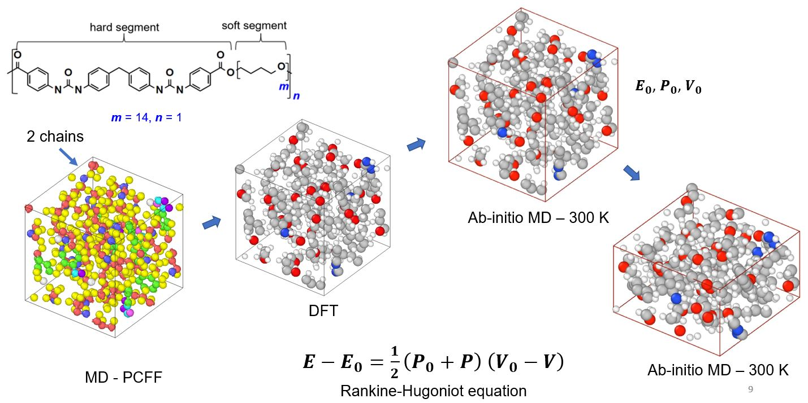

# Quantum and Classical Molecular Dynamics Simulations of Shocked Polyurea and Polyurethane 

This repository contains the MD (LAMMPS) models and the DFT based quantum MD (VASP) models, which we used in our recent work. The figure below gives an overview of our work; a video abstract is [available here](https://youtu.be/I9e1aksq53M). For more information, please see our article [Computational Materials Science (2022) Vol. 203, 111166](https://doi.org/10.1016/j.commatsci.2021.111166).

 
